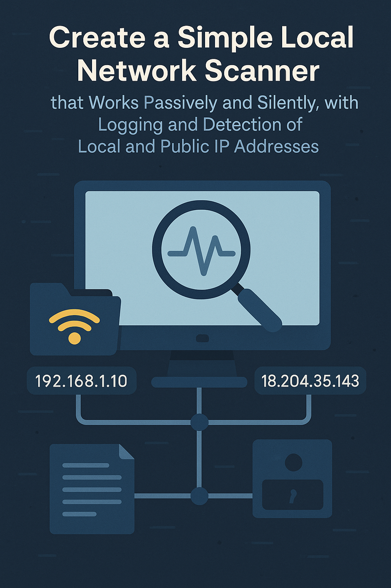

# 🖧 Network Scan Logger

A simple and passive Python script to monitor your local network. It logs your public IP and the devices discovered through the ARP table into a timestamped log file. Ideal for cybersecurity labs and home networks.

## 🔍 Features

- Logs public IP via `https://api.ipify.org`
- Parses ARP table to list:
  - IP address
  - MAC address
  - Hostname (if resolvable)
- Stores results in `network_scan.log` with timestamps
- Passive operation: does **not** trigger firewalls or IDS/IPS systems

## 🚀 How It Works

The script passively queries the ARP table and your public IP address, writing results to a simple log file. Unlike tools like `nmap`, it does not send TCP SYN packets or initiate any 3-way handshakes.

## 💻 Requirements

- Python 3.xx
- Windows 10 or 11 (recommended)
- Administrator privileges (to access full ARP table)

## 📦 Installation

pip install requests

python scanner.py

Make sure to run your terminal as Administrator.

## 🕓 Schedule Regular Scans
Use Windows Task Scheduler to run the script hourly or daily for continuous monitoring.

## 📄 Sample Output

[2025-04-11 18:35:00] Network Scan
Public IP: 102.145.211.34
Local ARP Table:
 - IP: 192.168.1.1     MAC: 00-09-0f-aa-bb-cc    Hostname: fortigate-fw.local
 - IP: 192.168.1.10    MAC: 00-0c-29-aa-bb-01    Hostname: kali-vm.local
 - IP: 192.168.1.11    MAC: 00-0c-29-aa-bb-02    Hostname: windows10-vm.local
 - IP: 192.168.1.12    MAC: 00-0c-29-aa-bb-03    Hostname: ubuntu-server.local
 - IP: 192.168.1.13    MAC: 00-0c-29-aa-bb-04    Hostname: win11-dev.local
 - IP: 192.168.1.14    MAC: 00-0c-29-aa-bb-05    Hostname: ad-dc-2022.lab.local
 - IP: 192.168.1.20    MAC: 00-0a-b7-cc-dd-01    Hostname: siemens-plc-s7-1200.local
 - IP: 192.168.1.21    MAC: 00-0a-b7-cc-dd-02    Hostname: hmi-panel.local
 - IP: 192.168.1.50    MAC: ac-de-48-12-34-56    Hostname: macbook-pro.local
 - IP: 192.168.1.254   MAC: 00-11-22-33-44-55    Hostname: home-router.local

## 🔖 MIT License

MIT License [MIT License](https://opensource.org/licenses/MIT), which is open, permissive, and widely accepted.
© 2025 Larbi Ouiyzme
